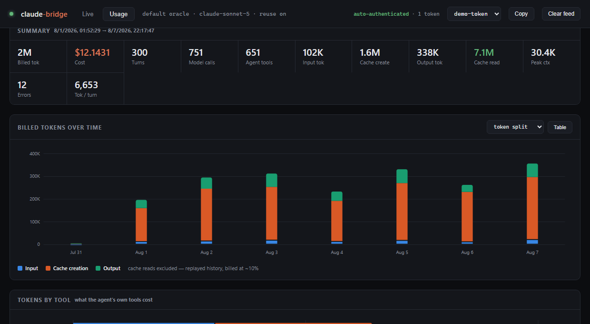

# claude-bridge

**Point any OpenAI or Anthropic client at your own Claude Code install.**

Building agentic flows normally means the API: a separate key, metered per token, a bill
that grows with every tool loop and dead end. But your machine already has an
authenticated `claude` CLI sitting there. This puts an OpenAI/Anthropic-shaped socket in
front of it — so your scripts, agents and eval harnesses drive it like any hosted model,
and you can see exactly what every call cost.



```bash
npm install && npm start
```

```python
from openai import OpenAI
client = OpenAI(base_url="http://127.0.0.1:8787/v1", api_key=KEY)   # key is printed on boot

client.chat.completions.create(model="claude-sonnet-5",         # plain completion
    messages=[{"role": "user", "content": "What is 6*7?"}])

client.chat.completions.create(model="claude-sonnet-5-semi",    # read-only agent
    messages=[{"role": "user", "content": "why is the build slow?"}])
```

That's it. Node 24+, a working `claude` CLI, zero runtime dependencies.

## What you get

- **Three levels of agent.** `oracle` — plain completions, no tools. `semi` — Claude Code
  restricted to a tool set you choose (read-only by default). `harness` — Claude Code
  intact. Pick per request; hand it tools of your own in any of them.
- **Token accounting that survives a tool loop.** A turn is many billed calls; the bridge
  measures each one and attributes tokens to individual tool calls. Charted, filterable,
  persisted. → [Token accounting](docs/token-accounting.md)
- **It doesn't re-pay for your history.** Stateless clients resend the whole conversation
  every turn; the bridge keeps a live CLI process per conversation and sends only the new
  message. → [Session reuse](docs/developers.md#not-wasting-tokens)
- **Both dialects, properly.** Streaming, tool calling, `response_format`, images — over
  `/v1/chat/completions` and `/v1/messages`.
- **A streamed reply says the same thing as a non-streamed one.** Reassembled deltas match
  what the same turn returns with `stream: false`, and a client that grounds on the answer
  rather than displaying it can ask for the authoritative text outright.
  → [Grounding on a streamed reply](docs/developers.md#grounding-on-a-streamed-reply)

The constraint moves rather than disappears: you spend plan capacity, so the ceiling is
your **rate limits**, which the bridge surfaces at `/health` and `/admin/stats`.

```
  OpenAI SDK ─┐
  Cursor    ──┤   http://host:8787/v1        ┌── claude --print --input-format stream-json
  Open WebUI ─┼──▶ claude-bridge ────────────┤   (one long-lived process per conversation)
  curl      ──┤    (token auth, SSE, usage)  └── your existing Claude Code auth
  LangChain ──┘
```

<details>
<summary><b>curl, and what boot looks like</b></summary>

```
claude-bridge listening on http://127.0.0.1:8787/v1
  API key      sk-bridge-...          # generated if you did not supply one
  dashboard    http://127.0.0.1:8787/ui
  default      mode=oracle model=claude-sonnet-5
```

```bash
curl http://127.0.0.1:8787/v1/chat/completions \
  -H "authorization: Bearer $KEY" -H "content-type: application/json" \
  -d '{"model":"claude-sonnet-5","messages":[{"role":"user","content":"What is 6*7?"}]}'
```

PowerShell aliases `curl` to `Invoke-WebRequest`, so use that instead:

```powershell
$TOKEN = (Invoke-RestMethod http://127.0.0.1:8787/admin/bootstrap).tokens[0]
$body  = @{ model="claude-sonnet-5"; messages=@(@{role="user";content="What is 6*7?"}) } | ConvertTo-Json -Depth 5
Invoke-RestMethod http://127.0.0.1:8787/v1/chat/completions -Method Post `
  -Headers @{ authorization = "Bearer $TOKEN" } -ContentType "application/json" -Body $body
```
</details>

## The three modes

Pick with the model suffix, or the `X-Claude-Mode` header. They differ in **who owns the
loop, and how much of the agent comes with it.**

| Mode | Model id | The agent gets | Use it for |
| --- | --- | --- | --- |
| `oracle` | `claude-sonnet-5` | nothing (`--tools ""`) | text in, text out — your code owns the loop |
| `semi` | `claude-sonnet-5-semi` | a tool set you choose, read-only by default | letting it investigate, safely |
| `harness` | `claude-sonnet-5-harness` | all of Claude Code | letting it actually do the work |

`semi` is the useful middle: the agent still runs its own loop, but only over
`Read, Glob, Grep, WebFetch, WebSearch, TodoWrite` unless you say otherwise.

```bash
curl ... -H "X-Claude-Mode: semi"                             # read-only agent
curl ... -H "X-Claude-Mode: semi" -H "X-Claude-Tools: Read,Grep"   # narrower still
```

`X-Claude-Tools` can only **narrow** what the mode offers, never widen it — otherwise any
client could promote itself to a full agent by naming `Bash`. Config sets the ceiling.

Separately, you can hand the bridge **your own** tools via the standard OpenAI/Anthropic
`tools` field and get calls back to run your side. That works in all three modes, and is
independent of the above.

→ [Modes, tool policy and the model catalog](docs/developers.md#models-and-disguising-the-backend)

## Watching it work

The dashboard is at `http://127.0.0.1:8787/ui` — opened locally it authenticates itself,
no key to paste. **Live** shows totals, running sessions and a streaming activity feed.
**Usage** is the token history: filter by window, mode, model or tool, and click any turn
to see its individual model calls. That is the GIF above.

```bash
node src/cli.ts watch    # same feed, in the terminal
node src/cli.ts chat     # a REPL against your own bridge
```

## Docs

- **[Token accounting](docs/token-accounting.md)** — what a turn, a model call and a tool
  call each cost, and why cache reads are excluded from the headline.
- **[Developer reference](docs/developers.md)** — endpoints and headers, the model catalog,
  session reuse, tool calling, config, security notes, limitations, tests.

## Tests

```bash
npm test          # 114 tests, no API calls, no cost
npm run typecheck
```

Driven by `test/fake-claude.mjs`, a stand-in speaking the same stream-json protocol —
including the awkward parts the real CLI does, like restating a message under the same id
or splitting a reply across text blocks.

`test/stream-parity.test.ts` pins the one invariant that spans both dialects: the text
deltas of a turn, reassembled, equal the authoritative reply. It cannot be proved — a CLI
record whose text never arrived as deltas is unrecoverable from the wire — but it turns a
future divergence into a failing test rather than a silently different answer.
